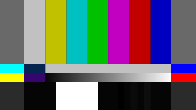

=======================
ColorBars / ColorBarsHD
=======================

The `ColorBars`_ and `ColorBarsHD`_ filters generate a video clip containing
`SMPTE color bars`_ scaled to any image size. Both filters also generate audio,
see the `audio`_ section for details.

.. _ColorBars:

ColorBars
---------

.. figure:: pictures/colorbars-320x240.png
   :align: left

**ColorBars** produces a video clip containing SMPTE color bars
(`Rec. ITU-R BT.801-1`_) scaled to any image size. By default, a 640x480, RGB32,
`TV range`_, 29.97 fps, 1 hour long clip is produced.

|clearfloat|

.. rubric:: Syntax and Parameters

::

    ColorBars (int "width", int "height", string "pixel_type", bool "staticframes")

.. describe:: width, height

    Set size of the returned clip.

    Default: 640, 480

.. describe:: pixel_type

    Set color format of the returned clip. May be any of the following: "RGB24",
    "RGB32", "RGB48", "RGB64", "YUY2", "YV12", "YV16" "YV24", "YV411", or any
    planar RGBPx, RGBAPx, YUV4xxPx, YUVA4xxPx format.

    Default: "RGB32"

.. describe:: staticframes

    If set to false, generate all frames. Default true (one static frame is served).

    Default: true

.. _ColorBarsHD:

ColorBarsHD
-----------

**ColorBarsHD** produces a video clip containing SMPTE color bars
(Rec. ITU-R BT.709 / `ARIB STD-B28 v1.0`_) scaled to any image size. By default,
a 1288x720, YV24, `TV range`_, 29.97 fps, 1 hour long clip is produced.

|clearfloat|

.. rubric:: Syntax and Parameters

::

    ColorBarsHD (int "width", int "height", string "pixel_type", bool "staticframes")

.. describe:: width, height

    Set size of the returned clip.

    Default: 1288, 720

.. describe:: pixel_type

    Set color format of the returned clip. Must be "YV24" or any YUV444Px /
    YUVA444Px format.

    Default: "YV24" (identical to "YUV444P8")

.. describe:: staticframes

    If set to false, generate all frames. Default true (one static frame is served).

    Default: true

Audio
-----

For both filters, an audio :doc:`tone <tone>` is also generated. The tone is a
440Hz sine at 48KHz sample rate, 32 bit (Float), stereo. The tone pulses in the
right speaker, being turned on and off once every second. Level is `0 dBFS`_.

You can use :doc:`Amplify <amplify>` to set a softer level (0dB can be a little
deafening!) ::

    ColorBarsHD
    AmplifyDB(-20)

Broadcasting organizations usually specify an "alignment tone" accompanying
colorbars at anywhere from -12 to -20 dBFS; if sending materials to another
party, be sure to get their preferred alignment tone level. The exact level
doesn't matter as long as all parties agree to it.

A note on notation
------------------

This page adopts the *ITU style* when discussing video levels which might be
represented at different bit depths:

    **“** To avoid confusion between 8-bit and 10-bit representations, the eight
    most-significant bits are considered to be an integer part while the two
    additional bits, if present, are considered to be fractional part.

    For example, the bit pattern ``10010001`` would be expressed as 145\ |d|,
    whereas the pattern ``1001000101`` would be expressed as 145.25\ |d|. **”**

    `ITU-R BT.601-7 (page 4)`_

Video levels shown below with the subscript "d" are assumed to be scaled by 2^(bit depth-8).
For example, 235\ |d| at bit depth 10 becomes 235 × 2^(10-8) = 235 × 4 = 940.

* see `Deep Color`_
* see `AviSynthPlus color formats`_

TV range
--------

For both filters, in all color formats, luminance levels are :doc:`TV (limited)
range <../advancedtopics/luminance_levels>`, where black=16\ |d| and white=235\ |d|,
within a total possible range of 0-255\ |d|.

The table below shows the TV-range values **ColorBarsHD** generates, and those
same values as they should be after converting to full range.

:math:`\mathtt{Y_\text{full} = (Y_\text{tv}-16_\text{d})  × 255_\text{d}/(235_\text{d}-16_\text{d})}` // (for R, G, B, Y)

:math:`\mathtt{U_\text{full} = (U_\text{tv}-128_\text{d}) × 255_\text{d}/(240_\text{d}-16_\text{d}) + 128_\text{d}}` // (for U, V)

:math:`\mathtt{Y_\text{tv}   = Y_\text{full} × (235_\text{d}-16_\text{d})/255_\text{d} + 16_\text{d}} \quad` // (for R, G, B, Y)

:math:`\mathtt{U_\text{tv}   = (U_\text{full}-128_\text{d}) × (240_\text{d}-16_\text{d})/255_\text{d} + 128_\text{d}}` // (for U, V)

.. table::
    :widths: auto

    +----------------+----------+----------+----------+-----+----------+----------+----------+-----+----------+----------+----------+-----+----------+----------+----------+
    | Color bar      | TV range output                                                       |     | (expanded to full range)                                              |
    +================+==========+==========+==========+=====+==========+==========+==========+=====+==========+==========+==========+=====+==========+==========+==========+
    |                | **R**    | **G**    | **B**    |     | **Y**    | **U**    | **V**    |     | **R**    | **G**    | **B**    |     | **Y**    | **U**    | **V**    |
    +----------------+----------+----------+----------+-----+----------+----------+----------+-----+----------+----------+----------+-----+----------+----------+----------+
    | **75% White**  | 180\ |d| | 180\ |d| | 180\ |d| |     | 180\ |d| | 128\ |d| | 128\ |d| |     | 191\ |d| | 191\ |d| | 191\ |d| |     | 191\ |d| | 128\ |d| | 128\ |d| |
    +----------------+----------+----------+----------+-----+----------+----------+----------+-----+----------+----------+----------+-----+----------+----------+----------+
    | **75% Yellow** | 180\ |d| | 180\ |d| | 16\ |d|  |     | 168\ |d| | 44\ |d|  | 136\ |d| |     | 191\ |d| | 191\ |d| | 0\ |d|   |     | 177\ |d| | 32\ |d|  | 137\ |d| |
    +----------------+----------+----------+----------+-----+----------+----------+----------+-----+----------+----------+----------+-----+----------+----------+----------+
    | **75% Cyan**   | 16\ |d|  | 180\ |d| | 180\ |d| |     | 145\ |d| | 147\ |d| | 44\ |d|  |     | 0\ |d|   | 191\ |d| | 191\ |d| |     | 150\ |d| | 149\ |d| | 32\ |d|  |
    +----------------+----------+----------+----------+-----+----------+----------+----------+-----+----------+----------+----------+-----+----------+----------+----------+
    | **75% Green**  | 16\ |d|  | 180\ |d| | 16\ |d|  |     | 133\ |d| | 63\ |d|  | 52\ |d|  |     | 0\ |d|   | 191\ |d| | 0\ |d|   |     | 136\ |d| | 54\ |d|  | 41\ |d|  |
    +----------------+----------+----------+----------+-----+----------+----------+----------+-----+----------+----------+----------+-----+----------+----------+----------+
    | **75% Magenta**| 180\ |d| | 16\ |d|  | 180\ |d| |     | 63\ |d|  | 193\ |d| | 204\ |d| |     | 191\ |d| | 0\ |d|   | 191\ |d| |     | 55\ |d|  | 201\ |d| | 214\ |d| |
    +----------------+----------+----------+----------+-----+----------+----------+----------+-----+----------+----------+----------+-----+----------+----------+----------+
    | **75% Red**    | 180\ |d| | 16\ |d|  | 16\ |d|  |     | 51\ |d|  | 109\ |d| | 212\ |d| |     | 191\ |d| | 0\ |d|   | 0\ |d|   |     | 41\ |d|  | 106\ |d| | 223\ |d| |
    +----------------+----------+----------+----------+-----+----------+----------+----------+-----+----------+----------+----------+-----+----------+----------+----------+
    | **75% Blue**   | 16\ |d|  | 16\ |d|  | 180\ |d| |     | 28\ |d|  | 212\ |d| | 120\ |d| |     | 0\ |d|   | 0\ |d|   | 191\ |d| |     | 14\ |d|  | 223\ |d| | 118\ |d| |
    +----------------+----------+----------+----------+-----+----------+----------+----------+-----+----------+----------+----------+-----+----------+----------+----------+

These colors are at "75%" of maximum, per common broadcast practice. You may
occasionally see "100%" color bars.\ `[1]`_ They are rather useless, as you cannot
detect gain or saturation that is too high on a signal that is already at maximum.

PLUGE
-----

The lower part of the frame is called the `PLUGE`_ (also lowercase: "pluge")
signal. From left to right it consists of: `-I`_, white, `+Q`_, then a series of
black and near-black bars: 0, -4, 0, +4 and 0 `IRE`_ relative to black.

    **Note** 'IRE' is used here to mean 'percent luminance', on a scale from
    0 (black) to 100 (white), ignoring the varying broadcast standards where
    black might be 0 IRE or 7.5 IRE depending on the country.

    This section documents the **ColorBars** pluge only; **ColorBarsHD**'s pluge
    is similar, but dispenses with -I and +Q.

The table below show the TV-range values **ColorBars** generates, and those same
values as they should be after converting to full range.

.. table::
    :widths: auto

    +----------------+----------+----------+----------+-----+----------+----------+----------+-----+----------+----------+----------+-----+----------+----------+----------+
    | PLUGE Element  | TV range output                                                       |     | (expanded to full range)                                              |
    +================+==========+==========+==========+=====+==========+==========+==========+=====+==========+==========+==========+=====+==========+==========+==========+
    |                | **R**    | **G**    | **B**    |     | **Y**    | **U**    | **V**    |     | **R**    | **G**    | **B**    |     | **Y**    | **U**    | **V**    |
    +----------------+----------+----------+----------+-----+----------+----------+----------+-----+----------+----------+----------+-----+----------+----------+----------+
    | **-I**         | 0\ |d|   | 58\ |d|  | 98\ |d|  |     | 16\ |d|  | 158\ |d| | 95\ |d|  |     | -19\ |d| | 49\ |d|  | 95\ |d|  |     | 0\ |d|   | 162\ |d| | 90\ |d|  |
    +----------------+----------+----------+----------+-----+----------+----------+----------+-----+----------+----------+----------+-----+----------+----------+----------+
    | **100% White** | 235\ |d| | 235\ |d| | 235\ |d| |     | 235\ |d| | 128\ |d| | 128\ |d| |     | 255\ |d| | 255\ |d| | 255\ |d| |     | 255\ |d| | 128\ |d| | 128\ |d| |
    +----------------+----------+----------+----------+-----+----------+----------+----------+-----+----------+----------+----------+-----+----------+----------+----------+
    | **+Q**         | 59\ |d|  | 15\ |d|  | 126\ |d| |     | 16\ |d|  | 174\ |d| | 149\ |d| |     | 50\ |d|  | -1\ |d|  | 128\ |d| |     | 0\ |d|   | 180\ |d| | 151\ |d| |
    +----------------+----------+----------+----------+-----+----------+----------+----------+-----+----------+----------+----------+-----+----------+----------+----------+
    | Black          | 16\ |d|  | 16\ |d|  | 16\ |d|  |     | 16\ |d|  | 128\ |d| | 128\ |d| |     | 0\ |d|   | 0\ |d|   | 0\ |d|   |     | 0\ |d|   | 128\ |d| | 128\ |d| |
    +----------------+----------+----------+----------+-----+----------+----------+----------+-----+----------+----------+----------+-----+----------+----------+----------+
    | **-4 IRE**     | 7\ |d|   | 7\ |d|   | 7\ |d|   |     | 7\ |d|   | 128\ |d| | 128\ |d| |     | -10\ |d| | -10\ |d| | -10\ |d| |     | -10\ |d| | 128\ |d| | 128\ |d| |
    +----------------+----------+----------+----------+-----+----------+----------+----------+-----+----------+----------+----------+-----+----------+----------+----------+
    | Black          | 16\ |d|  | 16\ |d|  | 16\ |d|  |     | 16\ |d|  | 128\ |d| | 128\ |d| |     | 0\ |d|   | 0\ |d|   | 0\ |d|   |     | 0\ |d|   | 128\ |d| | 128\ |d| |
    +----------------+----------+----------+----------+-----+----------+----------+----------+-----+----------+----------+----------+-----+----------+----------+----------+
    | **+4 IRE**     | 25\ |d|  | 25\ |d|  | 25\ |d|  |     | 25\ |d|  | 128\ |d| | 128\ |d| |     | 10\ |d|  | 10\ |d|  | 10\ |d|  |     | 10\ |d|  | 128\ |d| | 128\ |d| |
    +----------------+----------+----------+----------+-----+----------+----------+----------+-----+----------+----------+----------+-----+----------+----------+----------+
    | Black          | 16\ |d|  | 16\ |d|  | 16\ |d|  |     | 16\ |d|  | 128\ |d| | 128\ |d| |     | 0\ |d|   | 0\ |d|   | 0\ |d|   |     | 0\ |d|   | 128\ |d| | 128\ |d| |
    +----------------+----------+----------+----------+-----+----------+----------+----------+-----+----------+----------+----------+-----+----------+----------+----------+
    |                                                                                        |     | *(negative values will be clipped to 0)*                              |
    +----------------+----------+----------+----------+-----+----------+----------+----------+-----+----------+----------+----------+-----+----------+----------+----------+

The -I and +Q bars are vestigial artifacts of NTSC analog TV and are not really used any more.

    The -4, 0 and +4 IRE bars can be used to set your monitor brightness – assuming
    your playback chain expands TV range (16\ |d|-235\ |d|) to full-range (0-255\ |d|)
    as shown in the images above. The -4 IRE and 0 IRE bars should have the same
    apparent brightness (they should be as dark as the monitor can display), and the
    +4 should be a little brighter. If you can see the -4 bar, your monitor
    brightness is set too high; if you cannot see the +4 bar, your monitor
    brightness is set too low.\ `[2]`_

Note, the pluge signal goes out of 16-235\ |d| range in the -I and the -4 bars.
These cannot be accurately converted to 0-255\ |d| range.

More information about the colorbars and the PLUGE can be found on the
`color bars theory`_ page.

Miscellaneous
-------------

Note, that for example ::

    ColorBars(pixel_type="YUV444P8")

...is equivalent to ::

    ColorBars(pixel_type="RGB32")
    ConvertToYUV444(matrix="PC.601")
    # "PC.601" / "PC.709" / "PC.2020" don't scale the luma range

When directly generating YUV format data, the color transitions are arranged to
occur on a chroma-aligned boundary.

Changelog
---------

+------------------+---------------------------------------------------------+
| Version          | Changes                                                 |
+==================+=========================================================+
| AvsiSynth+ 3.4.0 || ColorBars: add support for all YUV(A)422 formats and   |
|                  |  RGB24, RGB48, YV411.                                   |
+------------------+---------------------------------------------------------+
| AvsiSynth+ r2487 || ColorBars: add support for all YUV(A)444/420, planar   |
|                  |  RGB(A) formats and RGB64.                              |
|                  || ColorBarsHD: add support for all YUV(A)444 formats.    |
+------------------+---------------------------------------------------------+
| AviSynth 2.6.0   || Added pixel_type="YV24" to ColorBars.                  |
|                  || Initial release of ColorBarsHD.                        |
+------------------+---------------------------------------------------------+
| AviSynth 2.5.6   || Added ``pixel_type`` parameter.                        |
|                  || Added "YUY2" and "YV12" pixel types.                   |
+------------------+---------------------------------------------------------+
| AviSynth 2.5.5   | Width and height parameters are now named and optional. |
+------------------+---------------------------------------------------------+

$Date: 2022/04/17 03:58:18 $

.. _SMPTE color bars:
    https://en.wikipedia.org/wiki/SMPTE_color_bars
.. _Rec. ITU-R BT.801-1:
    https://www.itu.int/rec/R-REC-BT.801/en
.. _ARIB STD-B28 v1.0:
    https://www.arib.or.jp/english/html/overview/doc/6-STD-B28v1_0-E1.pdf
.. _0 dBFS:
    https://en.wikipedia.org/wiki/DBFS
.. _ITU-R BT.601-7 (page 4):
    https://www.itu.int/rec/R-REC-BT.601-7-201103-I/en
.. _Deep Color:
    http://avisynth.nl/index.php/High_bit-depth_Support_with_Avisynth#What_is_Deep_Color.3F
.. _AviSynthPlus color formats:
    http://avisynth.nl/index.php/Avisynthplus_color_formats
.. _[1]:
    http://trac.ffmpeg.org/wiki/FilteringGuide#multipleinputoverlayin2x2grid
.. _PLUGE:
    https://en.wikipedia.org/wiki/Picture_line-up_generation_equipment
.. _-I:
    https://en.wikipedia.org/wiki/YIQ
.. _+Q:
    https://en.wikipedia.org/wiki/YIQ
.. _IRE:
    https://en.wikipedia.org/wiki/IRE_(unit)
.. _[2]:
    http://spearsandmunsil.com/portfolio-item/setting-the-brightness-control-2/
.. _color bars theory:
    http://avisynth.nl/index.php/ColorBars_theory

.. |d| replace:: :sub:`d`
.. |clearfloat|  raw:: html

    

