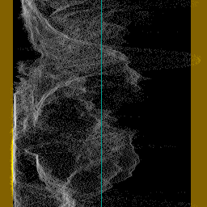
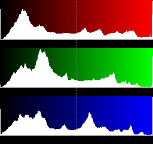
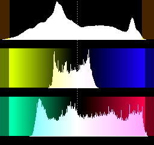
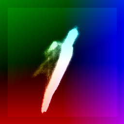
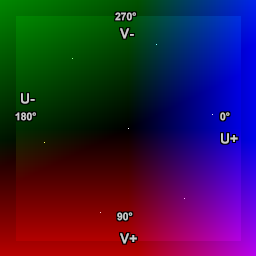
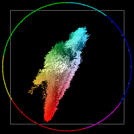
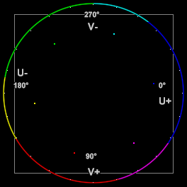
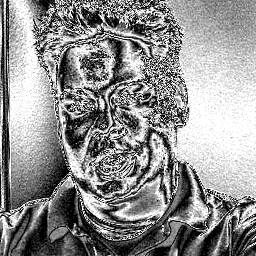
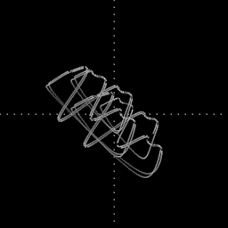
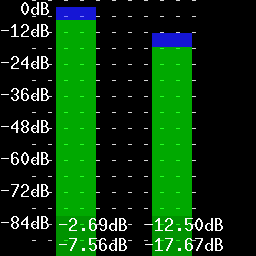

Histogram
=========

A multipurpose audio/video analysis tool.

Syntax and Parameters
----------------------

::

    Histogram (clip, string "mode", float "factor", int "bits", bool "keepsource", bool "markers")

.. describe:: clip

    Source clip; bit depths greater than 8 are supported in Classic, Levels,
    Luma and Colors modes only.

    * Classic, Color, Color2 and Luma modes support all planar YUV(A) formats.
    * Levels mode support RGB24/32/48/64 and all planar RGB(A)/YUV(A) formats.
    * Audiolevels and StereoOverlay modes support all 8-bit YUV(A) formats.
    * Stereo and StereoY8 accept any 8-bit format but always return a 512x512
      YUV420P8 or a Y8 clip respectively. If only an audio clip is given then
      the output clip will have a framerate of 25FPS.
    * Audiolevels and Stereo* modes support all audio samples types.

.. describe:: mode

    Select the ``mode`` to display:

    * :ref:`"Classsic" <histogram-classic>` : waveform mode;
    * :ref:`"Levels" <histogram-levels>` : RGB/YUV/Y histogram mode;
    * :ref:`"Color" <histogram-color>` : vectorscope mode;
    * :ref:`"Color2" <histogram-color2>` : vectorscope mode;
    * :ref:`"Luma" <histogram-luma>` : special viewing mode;
    * :ref:`"Audiolevels" <histogram-audiolevels>` : audio level meter; and
    * :ref:`"Stereo", "StereoOverlay", "StereoY8" <histogram-stereo>` : audio graphs.

    Default: "classic"

.. describe:: factor

    Applies only to Levels mode.

    The ``factor`` option specifies the way how the graphs are displayed,
    exaggerating the vertical scale. It is specified as percentage of the total
    population (that is number of luma or chroma pixels in a frame). For example,
    ``Histogram("Levels", 1.5625)`` will achieve a 1/64th cap. The vertical scale
    is multiplied by 100.0 / ``factor``.

    | Range: 0.0 - 100.0
    | Default: 100.0

.. describe:: bits

    Accepts 8, 9, 10, 11 or 12 as input. Applies only to Classic, Levels and
    Color modes.

    * Classic, Levels: increases the width of the histogram by 2\ :sup:`(bits-8)`
    * Color: increases width and height of the histogram by 2\ :sup:`(bits-8)`

    For example, ``Histogram(bits=10)`` returns a 1024-pixel wide histogram
    (width is 256 by default).

    Default: 8

.. describe:: keepsource

    If true, add histogram to right side of existing clip; else return the
    histogram portion only. Applies only to Classic, Levels, Color and Color2 modes.

    Default: true

.. describe:: markers

    If true, show calibration marks (see screenshots); else hide them.
    For Levels mode it will also remove the colored background. Applies only to
    Classsic and Levels modes.

    Default: true

.. _histogram-classic:

Classic mode
------------

This will add a per-line luminance graph (called a `Waveform Monitor`_) on the
right side of the video. The left side of the graph represents the minimum pixel
value (0) and the right side represents the maximum pixel value (for example,
255 for 8-bit). Values outside the valid  :doc:`CCIR-601 <limiter>` range are
shown in a brown/yellow-ish color, and a greenish line represents the midpoint
for limited range (e.g. 126 for 8-bit since the median of [16,235] is 125.5).

|clearfloat|

.. _histogram-levels:

Levels mode
-----------

This mode will display three `histograms`_ on the right side of the video frame.
This will show the distribution of the R,G,B or Y,U,V components in the current
frame.

The top graph displays the luma (R) or red (Y) distribution of the frame, where
the left side represents the minimum pixel value (0) and the right side
represents the maximum pixel value (for example, 255 for 8-bit). For YUV, the
valid :doc:`CCIR-601 <limiter>` range has been indicated by a slightly different
color. The midpoint is marked with a dotted line (for example, 128 for 8-bit).
The vertical axis shows the number of pixels for a given luma (Y) value. The
middle graph is similar and displays the G or U component, and the bottom graph
displays the B or V component.

|clearfloat|

.. _histogram-color:

Color mode
----------

This mode will display the chroma values (U/V color placement) in a two
dimensional graph (called a `vectorscope`_) on the right side of the video
frame. It can be used to read of the `hue`_ and `saturation`_ of a clip. At the
same time, it is a histogram. The whiter a pixel in the vectorscope, the more
pixels of the input clip correspond to that pixel (that is the more pixels have
this chroma value). The lighter background denotes the valid :doc:`CCIR-601 <limiter>` range.

Labels have been added to the second vectorscope image for explication purposes,
showing the U and V axes and degrees of hue. Spots have also been added,
showing 75% saturated :doc:`ColorBars <colorbars>` (clockwise from 0°: blue,
magenta, red, yellow, green and cyan).

The U component is displayed on the horizontal (X) axis, with the leftmost
side being U = 0 and the rightmost side being U = 255. The V component is
displayed on the vertical (Y) axis, with the top representing V = 0 and the
bottom representing V = 255.

The position of a spot on the scope corresponds to a chroma value from the
input clip. The graph can be used to read *hue* and *saturation*. As the hue of
a color changes, the spot moves around the center. As the saturation changes, it
moves in or out from the center. The center is where U and V equal 128, the
saturation is zero and the corresponding pixel has no color. As you increase
the saturation, the spot moves towards the edge.

At U=255, V=128 the hue is zero (blue) and the saturation is at maximum, that is,
saturation = sqrt( (U-128)\ :sup:`2` + (V-128)\ :sup:`2` ) or 127. When turning
hue clockwise 90 degrees, the chroma is given by U=128, V=255 (red, approximately).
Keeping the hue constant and decreasing the saturation, means that we move from
the circle to the center of the vectorscope. Thus the color flavor remains the
same, only it fades slowly to :doc:`greyscale <greyscale>`.

.. _histogram-color2:

Color2 mode
-----------

This mode will display the pixels in a two-dimensional graph (which is called
a `vectorscope`_) on the right side of the video frame. It can be used to read
of the `hue`_ and `saturation`_ of a clip.

The U component is displayed on the horizontal (X) axis, with the leftmost
side being U = 0 and the rightmost side being U = 255. The V component is
displayed on the vertical (Y) axis, with the top representing V = 0 and the
bottom representing V = 255. The grey square denotes the valid :doc:`CCIR-601 <limiter>` 
range.

As :ref:`above <histogram-color>`, labels and :doc:`ColorBars <colorbars>` dots
have been added to the second vectorscope image for explication purposes.

The position of a spot on the scope corresponds to a chroma value from the
input clip, exactly as with ``Histogram("color")``, but the spot is brighter
and in color.

**Color2** mode is also different from **Color** mode in that the background
is black instead of shaded, and a color wheel around the circumference of the
scope has been added, divided into six hues (clockwise from 0°: blue, magenta,
red, yellow, green and cyan), with white tick marks at 15 degree intervals.

|clearfloat|

.. _histogram-luma:

Luma mode
---------

This mode will amplify luminance, and display very small luminance
variations. This is good for detecting blocking and noise, and can be helpful
at adjusting filter parameters. In this mode a 1-pixel luminance difference
will show as a 16-pixel luminance pixel, thus seriously enhancing small
flaws.

|clearfloat|

.. _histogram-stereo:

Stereo, StereoY8 and StereoOverlay mode
---------------------------------------

This mode shows a stereo graph (known as a `goniometer`_ or phase scope), from
the audio in the clip. This can be used to see the left-right and phase
distribution of the input signal. Each frame will contain only information from
the current frame to the beginning of the next frame. The signal is linearly
upsampled 8x, to provide clearer visuals. Only **StereoOverlay** will overlay
the graph on top of the source clip. **Stereo** and **StereoY8** just return a
512x512 clip of the graph.

|clearfloat|

.. _histogram-audiolevels:

AudioLevels mode
----------------

Shows the audio levels in `decibels`_ for each channel present. For example, if
the source has six channels of audio, six vertical bars will be shown. The audio
levels are overlaid over the source clip.

The green bars show the *RMS* level and the blue bars show the *max* (peak)
level, both are calculated with the formulas listed below. The color of the bar
changes color to red and yellow whenever that specific channel's peak reaches
0.0dB.

|clearfloat|

**Formulas**

The green bars show the *RMS* (`Root Mean Square`_) level of the audio in each
video frame (let's say *n* samples) using the following formula:

.. math::  RMS = 20 * \log_{10}(1 / 32768 * \sqrt{1/n * \sum_{j=1}^n sample(j)^2})

The blue bars show the *max* (peak) level of the audio in each video frame
using the following formula:

.. math:: max = 20 * \log_{10}(max_{\text{j}}(sample(j))/32768)

The maximum possible level without `clipping`_ is 0 dB by definition. The
minimum level for 16 bit audio is therefore:

.. math:: 20 * \log_{10}(1/32768) = -90.31 dB \qquad (\text{since} \quad 2^{16} / 2 = 32768)

Changelog
---------

+-----------------+-------------------------------------------------------------+
| Version         | Changes                                                     |
+=================+=============================================================+
| AviSynth+ 3.7.2 || Added support for all YUV(A) formats (10-16 bit and float) |
|                 |  in "Luma" mode.                                            |
|                 || Fix: prevent crash when factor=0 in "Levels" mode.         |
|                 || Fix: "Levels" mode: fix incorrect "factor" applied for U/V |
|                 |  part drawing when format was subsampled (non-444).         |
|                 || Make "factor" a named parameter (previously an unnamed     |
|                 |  optional paramerer).                                       |
|                 || Fix: check for Planar RGB in "Audiolevels", "Color",       |
|                 |   "Color2" and "StereoOverlay" modes.                       |
|                 || Levels mode: stop using shades of grey on top of bars.     |
|                 || Levels mode: use bar color 255 for RGB instead of Y's 235. |
|                 |  (and scaled eqivivalents).                                 |
|                 || Fix: "Color" mode may crash on certain dimensions for      |
|                 |  subsampled formats.                                        |
|                 || Fix: "Color2" missing CCIR rectangle top and bottom line.  |
+-----------------+-------------------------------------------------------------+
| AviSynth+ 3.7.0 | Added support for all YUV(A) formats (10-16 bit and float)  |
|                 | in "Color2" mode.                                           |
+-----------------+-------------------------------------------------------------+
| AviSynth+ 3.6.1 | Added greyscale support in "Levels" mode.                   |
+-----------------+-------------------------------------------------------------+
| AviSynth+ 3.4.0 || Added ``keepsource`` and ``bits`` parameters.              |
|                 || Added support for RGB24/32/48/64 and all planar            |
|                 |  RGB(A)/YUV(A) formats in "Levels" mode.                    |
|                 || Added support for all YUV(A) formats (10-16 bit and float) |
|                 |  in "Classic" mode.                                         |
+-----------------+-------------------------------------------------------------+
| AviSynth 2.6.0  || Added "StereoY8" mode.                                     |
|                 || Added factor option to "Levels" mode.                      |
|                 || Improve colour of chroma legends in "Levels" mode.         |
+-----------------+-------------------------------------------------------------+
| AviSynth 2.5.8  || Added "Color2" and "AudioLevels" modes.                    |
|                 || Added YV12 support.                                        |
+-----------------+-------------------------------------------------------------+
| AviSynth 2.5.6  | Added invalid colors in YUY2 mode.                          |
+-----------------+-------------------------------------------------------------+
| AviSynth 2.5.5  | Added dots to "Stereo" mode to show bias/offsets.           |
+-----------------+-------------------------------------------------------------+
| AviSynth 2.5.4  | Added "Luma", "Stereo", and "StereoOverlay" modes.          |
+-----------------+-------------------------------------------------------------+
| AviSynth 2.5.3  | Added ``mode`` paramater and "Levels" and "Color" modes.    |
+-----------------+-------------------------------------------------------------+
| AviSynth 2.5.0  | Added markers to show invalid colors in YUV. Invalid values |
|                 | (below 16 and above 235) will be colored brown/yellow-ish.  |
+-----------------+-------------------------------------------------------------+

$Date: 2022/03/12 20:09:50 $

.. _histograms:
    https://en.wikipedia.org/wiki/Color_histogram
.. _Waveform Monitor:
    https://en.wikipedia.org/wiki/Waveform_monitor
.. _vectorscope:
    https://en.wikipedia.org/wiki/Vectorscope
.. _hue:
    https://en.wikipedia.org/wiki/Hue
.. _saturation:
    https://en.wikipedia.org/wiki/Colorfulness#Saturation
.. _decibels:
    https://en.wikipedia.org/wiki/Decibel
.. _Root Mean Square:
    https://en.wikipedia.org/wiki/Root_mean_square
.. _clipping:
    https://en.wikipedia.org/wiki/Clipping_(audio)
.. _goniometer:
    https://en.wikipedia.org/wiki/Goniometer_(audio)

.. |clearfloat|  raw:: html

    

