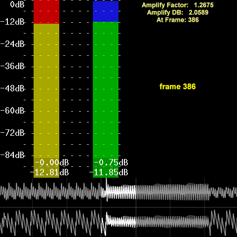

=========
Normalize
=========

Raises (or lowers) the loudest peak of the audio track to a given volume. This
process is called `audio normalization`_.

Note that **Normalize** performs `peak normalization`_ (used to prevent audio
clipping) and not `loudness normalization`_.

Syntax and Parameters
----------------------

::

    Normalize (clip, float "volume", bool "show")

.. describe:: clip

    | Source clip. Supported audio sample types: 16-bit integer and 32-bit float.
    | Other sample types (8, 24 and 32-bit integer) are automatically
      :doc:`converted <convertaudio>` to 32-bit float.

.. describe:: volume

    Set the amplitude of the loudest audio. Default = 1.0 for peaking at 0\ `dB`_:
    for `floating-point`_ samples, this corresponds to the range -1.0 to +1.0,
    and for 16-bit integer samples, this corresponds to the range -32768 to
    +32767 – the widest range possible without `clipping`_.

    * For a particular peak decibel level, use the equation ``volume`` =
      10 :sup:`dB` / 20
    * For example, set a -3dB peak with ``volume`` = 10\ :sup:`-3/20` or 0.7079.
    * Where multiple audio channels are present, all channel gains are set in
      proportion. For example, if the loudest peak on the loudest channel comes
      to -10dB, by default a gain of +10dB is applied to all channels.

    Default: 1.0

.. describe:: show

    If *true*, a text overlay will show the calculated amplification factor and
    the frame number of the loudest peak.

    Default: false

Normalization and Floating-point Audio
--------------------------------------

The idea of digital *clipping* (when the signal is outside the range that can be
stored accurately) really applies only to *integer* sample types; floating-point
samples will never become clipped in practice, as `the maximum value`_ is around
3.4×10\ :sup:`38` – some 29 orders of magnitude (580 dB) larger than 16-bit
samples can store.

**Normalize** is therefore not needed for floating-point audio, but using it is
recommended before converting to an integer type, especially if any processing
has been done – such as :doc:`amplification <amplify>`, :doc:`mixing <mixaudio>`
or :doc:`equalization <supereq>` – which may expand the audio peaks beyond the
integer clipping range.

Examples
--------

Normalize signal to 98% ::

    video = AviSource("video.avi")
    audio = WavSource("audio.wav").Normalize(0.98)
    return AudioDub(video, audio)

Normalize each channel separately (eg for separate language tracks)::

    video = AviSource("video.avi")
    audio = WavSource("audio2ch.wav")
    left_ch = GetChannel(audio,1).Normalize()
    right_ch = GetChannel(audio,2).Normalize()
    return AudioDub(video, MergeChannels(left_ch, right_ch))

Effect of ``show=true`` with added :doc:`Histogram <histogram>`, `Waveform`_ and
:ref:`current_frame <Special runtime variables and functions>` overlays::

    LoadPlugin("waveform.dll") # or autoload
    V = BlankClip(pixel_type="YUV444P8", width=480, height=360).Loop()
    A = WavSource("music.wav")
    AudioDub(V, A).AudioTrim(0.0, A.AudioDuration)
    ScriptClip(Last, """Subtitle(Last, "frame "+String(current_frame), align=5)""")
    Normalize(volume=1.0, show=true).Crop(0,0,-120,0).AddBorders(120,0,0,0)
    Histogram(mode="audiolevels")
    Waveform(window=3, under=true)
    return Last

   Showing frame 386 where the loudest peak was detected, but note that
   *Amplify Factor* is the same for all frames.

Changelog
----------

+-----------------+-----------------------------------------------------+
| Version         | Changes                                             |
+=================+=====================================================+
| AviSynth 2.5.0  | Replaced left and right parameters with ``volume``. |
+-----------------+-----------------------------------------------------+
| AviSynth 2.0.8  | Added ``show`` parameter.                           |
+-----------------+-----------------------------------------------------+
| AviSynth 2.0.3  | Added Normalize filter.                             |
+-----------------+-----------------------------------------------------+

$Date: 2022/03/05 15:10:22 $

.. _audio normalization:
    https://en.wikipedia.org/wiki/Audio_normalization
.. _peak normalization:
    https://en.wikipedia.org/wiki/Audio_normalization#Peak_normalization
.. _clipping:
    https://en.wikipedia.org/wiki/Clipping_(audio)#Digital_clipping
.. _loudness normalization:
    https://en.wikipedia.org/wiki/Audio_normalization#Loudness_normalization
.. _floating-point:
    http://avisynth.nl/index.php/Float
.. _dB:
    https://en.wikipedia.org/wiki/DBFS
.. _the maximum value:
    https://en.wikipedia.org/wiki/Single-precision_floating-point_format
.. _Waveform:
    http://avisynth.nl/index.php/Waveform
