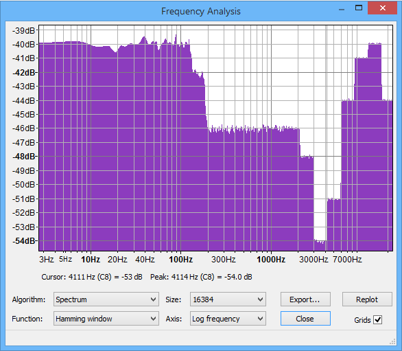
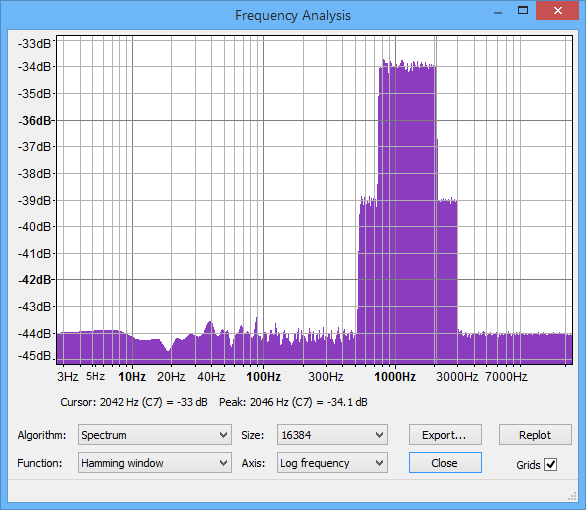

SuperEQ
=======

**Equalization** (British: equalisation, **EQ** for short) is the process of 
adjusting the balance between frequency components within an electronic signal. 
The most well known use of equalization is in sound recording and reproduction 
but there are many other applications in electronics and telecommunications. 
The circuit or equipment used to achieve equalization is called an equalizer. 
These devices boost or cut the energy of specific frequency bands. 
(source: wikipedia: `Equalization`_)

**SuperEQ** (Shibatch Super Equalizer) is a `graphic equalizer`_, originally 
created as a plugin for Winamp by `Naoki Shibata`_. **SuperEQ** uses 16383th 
order `FIR`_ filters using `FFT`_. Its equalization is very precise. Note that 
unlike traditional equalizers, there is very little `roll-off`_ or overlap 
between the bands.

Syntax and Parameters
----------------------

::

    SuperEQ (clip, string filename)
    SuperEQ (clip, int band1 [, int band2, ..., int band18])

.. describe:: clip

    Source clip. Supported audio sample types: 32-bit float. Use 
    :doc:`ConvertToFloat <convertaudio>` if necessary.

.. describe:: filename

    Set EQ bands from a preset file (see `Preset Files`_ below). 

.. describe:: band1, ..., band18

    | Set EQ bands within your script (see `Band Gain Arguments`_ below). 
    | The 18 bands cover the following frequency ranges:

    .. table::
        :widths: 30 35 35
        
        ========= ========== =========== 
        Band #    f (low)    f (high)   
        ========= ========== =========== 
        1         0 Hz       65 Hz      
        2         65 Hz      93 Hz      
        3         93 Hz      131 Hz     
        4         131 Hz     185 Hz     
        5         185 Hz     262 Hz     
        6         262 Hz     370 Hz     
        7         370 Hz     523 Hz     
        8         523 Hz     740 Hz     
        9         740 Hz     1047 Hz    
        10        1047 Hz    1480 Hz    
        11        1480 Hz    2093 Hz    
        12        2093 Hz    2960 Hz    
        13        2960 Hz    4186 Hz    
        14        4186 Hz    5920 Hz    
        15        5920 Hz    8372 Hz    
        16        8372 Hz    11840 Hz   
        17        11840 Hz   16744 Hz   
        18        16744 Hz   22000±Hz   
        ========= ========== =========== 
    
    | Frequency ranges apply to both *.feq* preset files and the ``band`` arguments.
    | (Adapted from  AviSynthPlus/plugins/Shibatch/`supereq.h`_ ) 

Examples
--------

Below are examples and additional information on how to use ``preset`` files 
and the ``band`` parameters.

Preset Files
^^^^^^^^^^^^

**SuperEQ** can accept a `foobar2k`_ equalizer Preset (.feq) file. Foobar's 
equalizer can be found in the `DSPManager`_, and presets are adjusted and saved 
from there as well.

    A Preset file is a text file with a positive or negative integer on each 
    line. Nothing else is allowed on the line, except white space. Empty (blank) 
    lines are ignored. Each line sets the gain in decibels for a frequency band. 
    All text after the first 18 non-empty lines is ignored, allowing you to add 
    comments to the file.

Preset files can be found in your \\AviSynth+\\Examples folder or `here`_, or 
may be found by searching the Web for "foobar2000 presets."

**Example 1**: *Using a Preset file*::

    SuperEq("C:\Equalizer Presets\Loudness.feq")

Contents of Loudness.feq::

    4
    4
    4
    2
    -2
    -2
    -2
    -2
    -2
    -2
    -2
    -4
    -10
    -7
    0
    3
    4
    4

    *comment* 
    (text after the first 18 non-empty lines will be ignored)

To give a very rough indication of the frequency response of the above example, 
here is a screenshot of an `Audacity`_ spectrum analysis of processed 
`white noise`_ (which should be approximately flat without equalization, 
allowing for low-frequency variability).

Band Gain Arguments
^^^^^^^^^^^^^^^^^^^

``Band`` gain arguments allow all 18 bands to be set within your script, instead 
of requiring a *preset file*. The values are specified in decibels (in integer 
format).

**Example 2**: *Boost midrange (speech) using* ``band`` *arguments*::

    ConvertAudioToFloat()
    SuperEQ(
    \   0,  [*     0 -    65  *]
    \   0,  [*    65 -    93  *]
    \   0,  [*    93 -   131  *]
    \   0,  [*   131 -   185  *]
    \   0,  [*   185 -   262  *]
    \   0,  [*   262 -   370  *]
    \   0,  [*   370 -   523  *]
    \   5,  [*   523 -   740  *]
    \  10,  [*   740 -  1047  *]
    \  10,  [*  1047 -  1480  *]
    \  10,  [*  1480 -  2093  *]
    \   5,  [*  2093 -  2960  *]
    \   0,  [*  2960 -  4186  *]
    \   0,  [*  4186 -  5920  *]
    \   0,  [*  5920 -  8372  *]
    \   0,  [*  8372 - 11840  *]
    \   0,  [* 11840 - 16744  *]
    \   0   [* 16744 - 22000± *]
    \ )
    Normalize() ## avoid possible overload
    ConvertAudioTo16bit() 

To give a very rough indication of the frequency response of the above example, 
here is a screenshot of an `Audacity`_ spectrum analysis of processed 
`white noise`_ (which should be approximately flat without equalization, 
allowing for low-frequency variability).

Changelog
---------

+------------------+------------------------------------------------------------------------+
| Version          | Changes                                                                |
+==================+========================================================================+
| AviSynth+ <r1555 || Convert SuperEQ into a proper plugin (Shibatch.dll).                  |
|                  || SuperEQ no longer automatically converts input clip to Float.         |
|                  |  (2013/09/15)                                                          |
+------------------+------------------------------------------------------------------------+
| AviSynth 2.6.1   | SuperEQ gain arguments can only be int, enforce it.                    |
+------------------+------------------------------------------------------------------------+
| AviSynth 2.6.0   | Added custom band setting to allow all 16 bands to be set from script. |
+------------------+------------------------------------------------------------------------+
| AviSynth 2.5.4   | Initial Release                                                        |
+------------------+------------------------------------------------------------------------+

| Some parts of SuperEQ are:
| Copyright © Naoki Shibata

| Other parts are:
| Copyright © 2001-2003, Peter Pawlowski All rights reserved.

$Date: 2022/02/12 15:10:22 $

.. _Equalization:
    https://en.wikipedia.org/wiki/Equalization_%28audio%29
.. _graphic equalizer:
    https://en.wikipedia.org/wiki/Equalization_%28audio%29#Graphic_equalizer
.. _Naoki Shibata:
    http://shibatch.sourceforge.net/
.. _FIR:
    https://en.wikipedia.org/wiki/Finite_impulse_response
.. _FFT:
    https://en.wikipedia.org/wiki/Fast_Fourier_transform
.. _roll-off:
    https://en.wikipedia.org/wiki/Roll-off
.. _supereq.h:
    https://github.com/AviSynth/AviSynthPlus/blob/master/plugins/Shibatch/supereq.h
.. _foobar2k:
    http://www.foobar2000.org
.. _DSPManager:
    https://wiki.hydrogenaud.io/index.php?title=Foobar2000:Preferences:Playback:DSP_Manager
.. _here:
    https://github.com/AviSynth/AviSynthPlus/tree/master/distrib/Examples/Equalizer%20Presets
.. _here2:
    https://web.archive.org/web/20040405181005if_/http://www.beingalink.de:80/files/Equalizer%20Presets.rar
.. _Audacity:
    https://www.audacityteam.org/
.. _white noise:
    https://en.wikipedia.org/wiki/White_noise
