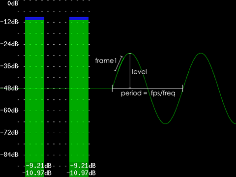

Tone
====

**Tone** generates sound (a waveform) at a given ``frequency`` for a given
``length`` of time in seconds. The output audio sample type is 32-bit float.
Use :doc:`ConvertAudio <convertaudio>` if this is not what you want.

Syntax and Parameters
----------------------

::

    Tone (float "length", float "frequency", int "samplerate", int "channels", string "type", float "level")

.. describe:: length

    Length of time in seconds.

    Default: 10.00

.. describe:: frequency

    Tone frequency.

    Default: 440

.. describe:: samplerate

    Audio sample rate.

    Default: 48000

.. describe:: channels

    Number of audio channels.

    Default: 2

.. describe:: type

    "Silence", "Sine", "Noise", "Square", "Triangle" or "Sawtooth".

    Default: "Sine"

.. describe:: level

    | The amplitude of the waveform. Default = 1.0 (or 0\ `dB`_, the maximum level
      possible without `clipping`_).
    | For a particular decibel level, use the equation ``level`` =
      10 :sup:`dB / 20`
    | For example, create a -12dB tone with ``level`` = 10\ :sup:`-12/20` or 0.251.

    Default: 1.0

Discussion
----------

``Tone(frequency=2, samplerate=48000, channels=2, type="sine", level=0.4)``

In the figure above, a sinus is generated (on a black clip with framerate 24
fps). The period of the waveform (in frames) is the *framerate* divided by
*frequency* (or fps/freq, which is 24/2=12 frames in our example). The part of
the graph which is light-green represents all samples of the frame under
consideration (which is frame 1 here). The number of samples in a particular
frame is given by the *samplerate* divided by the *framerate* (which is
48000/24 = 2000 samples in our example).

More generally, the waveform above is described by

    ``g(n,s) = level * sin(2*pi*(frequency*n/framerate + s*frequency/samplerate))``

with *n* the frame and *s* the sample under consideration (note that s runs
from 0 to samplerate/framerate - 1).

In the example above, this reduces to

    ``g(n,s) = 0.4 * sin(2*pi*(2*n/24 + s*2/48000))``

with *n* the frame and *s* the sample under consideration (note that s runs
from 0 to 1999).

Note that the bars are made with :doc:`Histogram <histogram>` and the graph with
the `AudioGraph`_ plugin.

Examples
--------

`We Wish You a Merry Christmas`_, in harmony (author hanzfrunz)

Changelog
---------

+----------------+----------------------------+
| Version        | Changes                    |
+================+============================+
| AviSynth 2.5.6 | Added ``level`` parameter. |
+----------------+----------------------------+
| AviSynth 2.5.4 | Initial release.           |
+----------------+----------------------------+

$Date: 2022/03/04 00:53:01 $

.. _dB:
    https://en.wikipedia.org/wiki/Decibel
.. _clipping:
    https://en.wikipedia.org/wiki/Clipping_(audio)
.. _AudioGraph:
    http://avisynth.nl/index.php/AudioGraph
.. _We Wish You a Merry Christmas:
    https://forum.doom9.org/showthread.php?t=172979
