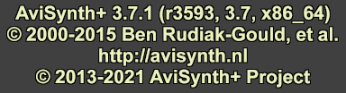

Version
=======

**Version** by default generates a 24\ `fps`_, 10-second, `RGB24`_\-format video
clip with a version, build time, copyright statement, and homepage information
in 24-point, Arial, light yellow (:doc:`$ECF2BF <../syntax/syntax_colors>`) text
on a 25% grey ($404040) background. Width and height are automatically chosen to
fit the message, so clip size varies by version.

Syntax and Parameters
----------------------

.. code::

    Version(int "length", int "width", int "height", string "pixel_type", clip "clip")

.. describe:: length

    Length of the resulting clip (in frames).

    Default: 240

.. describe:: width, height

    Width and height of the resulting clip.
    When set to  -1 (or <= 0), it is automatically sized to fit font size 24.

    Default: -1, -1

.. describe:: pixel_type

    Pixel type of the resulting clip. See :doc:`Blankclip <blankclip>` for a
    complete list of color formats.

    Default: "RGB24"

.. describe:: clip

    Template clip; if present, the resulting clip will have the clip-properties
    of the template, except for the properties defined explicitly.

Changelog
---------

+-----------------+---------------------------------------------------------+
| Version         | Changes                                                 |
+=================+=========================================================+
| AviSynth+ 3.7.2 | Added parameters ``length, width, height, pixel_type``, |
|                 | and ``clip``.                                           |
+-----------------+---------------------------------------------------------+

$Date: 2022/03/03 21:28:07 $

.. _fps:
    http://en.wikipedia.org/wiki/Frame_rate
.. _RGB24:
    http://avisynth.nl/index.php/RGB24
